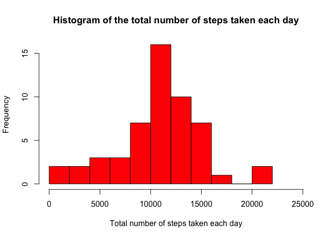
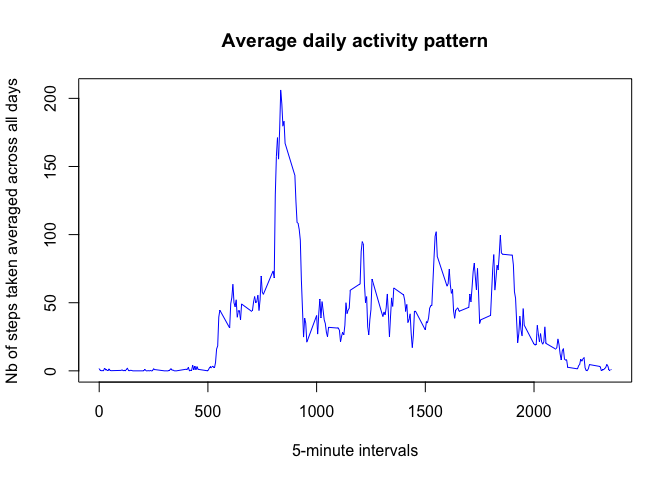
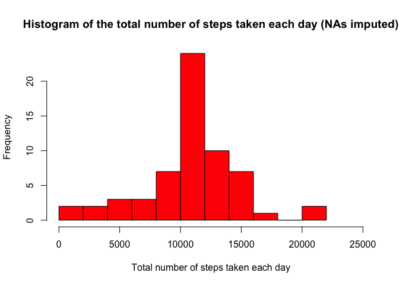
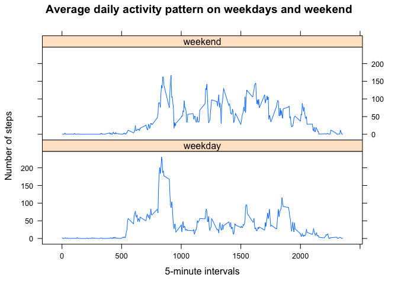

# Reproducible Research : Peer Assessment Project 1
Romain Faure  
January 2016  

# Introduction

This peer assessment project is part of the [Reproducible Research](https://www.coursera.org/learn/reproducible-research/home/welcome) 4-weeks online course offered by the [Johns Hopkins Bloomberg School of Public Health](http://www.jhsph.edu/) (Baltimore, USA) on [Coursera](https://www.coursera.org). [Reproducible Research](https://www.coursera.org/learn/reproducible-research/home/welcome) is the fifth course of the 11-months [JH Data Science Specialization](https://www.coursera.org/specialization/jhudatascience/1). 

Now back to the project : as you may know, it is now possible to collect a large amount of data about personal movement using activity monitoring devices such as a Fitbit, Nike Fuelband, or Jawbone Up. These type of devices are part of the “quantified self” movement – a group of enthusiasts who take measurements about themselves regularly to improve their health, to find patterns in their behavior, or because they are tech geeks. But these data remain under-utilized both because the raw data are hard to obtain and there is a lack of statistical methods and software for processing and interpreting the data.

This assignment makes use of data from a personal activity monitoring device. This device collects data at 5 minute intervals through out the day. The data consists of two months of data from an anonymous individual collected during the months of October and November 2012 and include the number of steps taken in 5-minute intervals each day.

# Downloading the raw data

The dataset for this assignment can be downloaded from the [course web site](https://d396qusza40orc.cloudfront.net/repdata%2Fdata%2Factivity.zip).


```r
## REPRODUCIBLE RESEARCH - PROJECT 1
## Data downloading script

## check if a "data" directory exists in the current working directory
## and create it if not
if (!file.exists("data")) { 
    dir.create("data")
}

## download the file
fileUrl <- "https://d396qusza40orc.cloudfront.net/repdata%2Fdata%2Factivity.zip"
download.file(fileUrl, "./data/activity.zip", method = "curl")

## unzip the file in the "data" sub-directory
unzip("./data/activity.zip", exdir = "./data/")

## delete the original zip file once it's been unzipped
unlink("./data/activity.zip")

## save and print the download time and date
downloadedDate <- date()
sprintf("File downloaded and unzipped on : %s", downloadedDate)
```

```
## [1] "File downloaded and unzipped on : Sat Jan  9 20:25:02 2016"
```

# Notes on the original raw data 

The downloaded file is a ZIP archive of 54 Ko. Once unzipped, the original raw data consists of one comma-separated-value (CSV) file of 351 Ko called "activity.csv".   
     
The original dataset is made of 17 568 observations :      
*(Nb of measurements per hour) x Nb of hours per day x (Nb of days in October and November) = Total Nb of measurements*
    

```r
(60 / 5) * 24 * (31 + 30)
```

```
## [1] 17568
```
    
The 3 variables included in this dataset are :

- ```steps``` *(integer)* : Number of steps taken in a 5-minute interval (missing values are coded as 𝙽𝙰)

- ```date``` *(factor)* : The date on which the measurement was taken in YYYY-MM-DD format

- ```interval``` *(integer)* : Identifier for the 5-minute interval in which measurement was taken

# Loading and exploring the data


```r
activity1 <- read.csv(file = "./data/activity.csv")
```


```r
str(activity1)
```

```
## 'data.frame':	17568 obs. of  3 variables:
##  $ steps   : int  NA NA NA NA NA NA NA NA NA NA ...
##  $ date    : Factor w/ 61 levels "2012-10-01","2012-10-02",..: 1 1 1 1 1 1 1 1 1 1 ...
##  $ interval: int  0 5 10 15 20 25 30 35 40 45 ...
```

As we can see above, ```steps``` and ```interval```are integer variables. ```date``` is a factor variable with 61 levels (31 days in November and 30 days in October).    
    
The raw dataset does not seeem to need any preprocessing, apart from the NA issue in the ```steps``` variable (we'll take care of that later).

# Loading packages for the analysis

For this analysis we'll use the [dplyr package](https://cran.r-project.org/web/packages/dplyr/index.html) so it needs to be installed and loaded before starting the actual analysis :


```r
library(dplyr)
```

```
## 
## Attaching package: 'dplyr'
## 
## The following objects are masked from 'package:stats':
## 
##     filter, lag
## 
## The following objects are masked from 'package:base':
## 
##     intersect, setdiff, setequal, union
```

```r
library(lattice)
```

# Total, mean and median number of steps taken each day

As we've already seen, the ```steps``` variable contains NAs, for example no data is available for the 1st or the 8th of October 2012, among other days. We will ignore the missing values in the dataset for this part of the assignment, hence the use of the ```na.omit()``` function below when calculating the **total sum of steps per day**, and the size of the resulting grouped data frame (53 rows only instead of 61) :


```r
activity1grp1 <- activity1 %>% group_by(date) %>% na.omit() %>% summarise_each(funs(sum))
print.data.frame(activity1grp1[, 1:2])
```

```
##          date steps
## 1  2012-10-02   126
## 2  2012-10-03 11352
## 3  2012-10-04 12116
## 4  2012-10-05 13294
## 5  2012-10-06 15420
## 6  2012-10-07 11015
## 7  2012-10-09 12811
## 8  2012-10-10  9900
## 9  2012-10-11 10304
## 10 2012-10-12 17382
## 11 2012-10-13 12426
## 12 2012-10-14 15098
## 13 2012-10-15 10139
## 14 2012-10-16 15084
## 15 2012-10-17 13452
## 16 2012-10-18 10056
## 17 2012-10-19 11829
## 18 2012-10-20 10395
## 19 2012-10-21  8821
## 20 2012-10-22 13460
## 21 2012-10-23  8918
## 22 2012-10-24  8355
## 23 2012-10-25  2492
## 24 2012-10-26  6778
## 25 2012-10-27 10119
## 26 2012-10-28 11458
## 27 2012-10-29  5018
## 28 2012-10-30  9819
## 29 2012-10-31 15414
## 30 2012-11-02 10600
## 31 2012-11-03 10571
## 32 2012-11-05 10439
## 33 2012-11-06  8334
## 34 2012-11-07 12883
## 35 2012-11-08  3219
## 36 2012-11-11 12608
## 37 2012-11-12 10765
## 38 2012-11-13  7336
## 39 2012-11-15    41
## 40 2012-11-16  5441
## 41 2012-11-17 14339
## 42 2012-11-18 15110
## 43 2012-11-19  8841
## 44 2012-11-20  4472
## 45 2012-11-21 12787
## 46 2012-11-22 20427
## 47 2012-11-23 21194
## 48 2012-11-24 14478
## 49 2012-11-25 11834
## 50 2012-11-26 11162
## 51 2012-11-27 13646
## 52 2012-11-28 10183
## 53 2012-11-29  7047
```

Then we can make a **histogram** showing the distribution of the total number of steps taken each day. I chose to break the distribution into 10 bins instead of the default (5) to have a finer resolution, using the ```breaks = 10``` argument :


```r
hist(activity1grp1$steps, breaks = 10, xlab = "Total number of steps taken each day", 
     main = "Histogram of the total number of steps taken each day", col = "red", xlim = c(0, 25000))
```

 
   
We'll now calculate and report the **mean and median** of the total number of steps taken per day :


```r
mean(activity1grp1$steps)
```

```
## [1] 10766.19
```

```r
median(activity1grp1$steps)
```

```
## [1] 10765
```

# Time series plot of the average number of steps taken

We'll now make a time series plot (i.e. ```type = "l"```) of the 5-minute intervals (on the x-axis) and the number of steps taken averaged across all days (on the y-axis), so as to determine the average daily activity pattern of the individual :


```r
activity1grp2 <- activity1 %>% group_by(interval) %>% na.omit() %>% summarise_each(funs(mean))
plot(activity1grp2$interval, activity1grp2$steps, type = "l", xlab = "5-minute intervals", 
     ylab = "number of steps taken averaged across all days", main = "Average daily activity pattern", col = "blue")
```

 

We can see the subject seems to get up around the 600th interval, which corresponds to 6am. Then we notice that on average the highest peak of activity in terms of steps seems to be located between the 800th and 900th intervals, i.e. between 8 and 9am - this could maybe correspond to the time the individual goes running everyday or walks to the office. Then the main part of activity seems to be located between the 1200th and 1900th intervals, i.e. between 12pm and 7pm roughly, that is to say the afternoon, which seems logical.   
     
Let's now check our findings above regarding the highest peak of activity, by calculating which 5-minute interval contains the maximum number of steps on average across all the days in the dataset :


```r
peakint <- activity1grp2$interval[which.max(activity1grp2$steps)]
sprintf("The 5-minute interval containing the maximum number of steps on average is the %sth", peakint)
```

```
## [1] "The 5-minute interval containing the maximum number of steps on average is the 835th"
```

# Imputing missing values

As we've seen earlier, there are a number of days/intervals where there are missing values (coded as NAs). The presence of missing days may introduce bias into some calculations or summaries of the data.   
    
We will start by calculating the total number of missing values in the dataset, per column :


```r
sum(is.na(activity1$steps))
```

```
## [1] 2304
```

```r
sum(is.na(activity1$date))
```

```
## [1] 0
```

```r
sum(is.na(activity1$interval))
```

```
## [1] 0
```

So we can see that there are 2 304 missing values, all located in the ```steps``` column. This means we have 2 304 rows with NAs out of the 17 568 total rows of the dataset, which corresponds to 13.11% of missing values (2304 * 100 / 17568).

Now that we have a clear picture of the NAs in our dataset, it's time to devise a strategy for filling in all of these missing values. We first create a copy of the original dataset that we're calling ```activity2``` and then decide to replace the NAs with the mean (across all days) of the 5-minute interval for which data is missing, as this seems to be the best option to replace NAs with realistic values :


```r
activity2 <- activity1

for(i in 1:length(activity1$steps)) {
        if (is.na(activity1$steps[i]) == TRUE) {
                int <- activity1$interval[i]
                activity2$steps[i] <- ceiling(activity1grp2$steps[activity1grp2$interval == int])                
        }
}
```

Remember that the original ```activity``` dataset did not contain any ```steps``` value for the 1st of October 2012 (among other days) :


```r
head(activity1, 10)
```

```
##    steps       date interval
## 1     NA 2012-10-01        0
## 2     NA 2012-10-01        5
## 3     NA 2012-10-01       10
## 4     NA 2012-10-01       15
## 5     NA 2012-10-01       20
## 6     NA 2012-10-01       25
## 7     NA 2012-10-01       30
## 8     NA 2012-10-01       35
## 9     NA 2012-10-01       40
## 10    NA 2012-10-01       45
```

We can now check that in our new ```activity2``` dataset, the first 10 rows, i.e. the first 10 intervals of the 1st of October 2012, no longer contain any NA :


```r
head(activity2, 10)
```

```
##    steps       date interval
## 1      2 2012-10-01        0
## 2      1 2012-10-01        5
## 3      1 2012-10-01       10
## 4      1 2012-10-01       15
## 5      1 2012-10-01       20
## 6      3 2012-10-01       25
## 7      1 2012-10-01       30
## 8      1 2012-10-01       35
## 9      0 2012-10-01       40
## 10     2 2012-10-01       45
```

Indeed all the NAs have now been replaced by the the mean of the 5-minute interval for which data was missing (rounded to the nearest higher integer, using the ```ceiling``` function).     
Let's double-check by computing the number of NAs in our new ```activity2``` dataset :


```r
sum(is.na(activity2))
```

```
## [1] 0
```


# Total, mean and median number of steps taken each day with missing values imputed

Now that the missing values have been imputed, we will make a new **histogram** of the total number of steps taken each day :


```r
activity2grp1 <- activity2 %>% group_by(date) %>% summarise_each(funs(sum))
hist(activity2grp1$steps, breaks = 10, xlab = "Total number of steps taken each day", 
     main = "Histogram of the total number of steps taken each day (NAs imputed)", col = "red", xlim = c(0, 25000))
```

 

This histogram can look quite similar to the first one we made before imputing the NAs, but actually if we look closer we can see than all bins/intervals now have a lower frequency, apart from the highest bin (located between 10 000 and 12 500 steps) which doesn't seem to be affected.

We'll also re-calculate and report the **mean and median** of the total number of steps taken per day now that the NAs have been imputed :


```r
mean(activity2grp1$steps)
```

```
## [1] 10784.92
```

```r
median(activity2grp1$steps)
```

```
## [1] 10909
```

Compared to the values computed before imputing the NAs, both the mean and the median have increased but in different proportions : the mean went from 10 766 to 10 785, while the median went from 10 765 to 10 909. So we can see that the median value saw the biggest change (+ 1.34%), while the mean value didn't change a lot (+ 0.18%). But as the percentages show, both changes remain quite small. Therefore the impact of imputing the missing values seems to be limited.

# Panel plot comparing the average number of steps taken per 5-minute interval across weekdays and weekends

We fist need to convert the ```date``` factor variable of our ```activity2``` dataset to the class "Date" using the ```as.Date``` function :


```r
activity2$date <- as.Date(activity2$date)
class(activity2$date)
```

```
## [1] "Date"
```

We will now create a new factor variable called ```type``` in the ```activity2``` dataset with two levels, “weekday” and “weekend”, indicating whether a given date is a weekday or a weekend day. We can determine if a given date is a weekday or a weekend day using the ```weekdays``` function. The code below refers to the week days in their French abbreviated forms :


```r
activity2 <- activity2 %>% mutate(type = NA)
for(i in 1:length(activity2$date)) {
        day <- weekdays(activity2$date[i], abbreviate = TRUE)
        if (day %in% c("Lun", "Mar", "Mer", "Jeu", "Ven")) {
                activity2$type[i] <- "weekday"
        }
        else activity2$type[i] <- "weekend"
}
activity2$type <- factor(activity2$type)
```

Let's now look at the result of our ```for``` loop above :


```r
table(activity2$type)
```

```
## 
## weekday weekend 
##   12960    4608
```

We have 12 960 weekdays intervals and 4608 weekend intervals. Let's check these numbers, keeping in mind that there were 45 weekdays and 16 weekend days out of the 61 days of October-November 2012 :


```r
17568*(45/61)
```

```
## [1] 12960
```

```r
17568*(16/61)
```

```
## [1] 4608
```


We will now make a panel plot containing 2 time series plots of the 5-minute intervals (on the x-axis) and the number of steps taken (on the y-axis) averaged across all weekdays (bottom panel) or weekend days (top panel)  :


```r
activity2grp2 <- activity2 %>% select(-date) %>% group_by(type, interval) %>% summarise_each(funs(mean))
xyplot(steps ~ interval | type, data = activity2grp2, type = "l", xlab = "5-minute intervals", 
       ylab = "Number of steps", main = "Average daily activity pattern on weekdays and weekend", 
       layout = c(1, 2))
```

 

Without surprise we can notice some differences in activity patterns between weekdays and weekend days : 
- During the weekend the activity starts later (around 8-9am instead of 6am during the week) and continues a little bit later as well.
- We can also see that the activity is quite homogeneously spread between 9am and 9pm on weekend days, more homogeneously than on weekdays.
- There seems to be more steps/walking/movement during weekends than during weekdays, which is especially visible during the afternoon. Maybe because during weekends the individual does not have to sit all day at the office ?
- The 8-9am peak of activity during weekdays is a lot less obvious during weekends. Maybe because the individual does not go to work or does not go running ?

# Additional information

- This analysis was done in RStudio 0.99.467 (R version 3.2.2 (2015-08-14) -- "Fire Safety") on Mac OSX 10.10.5.
